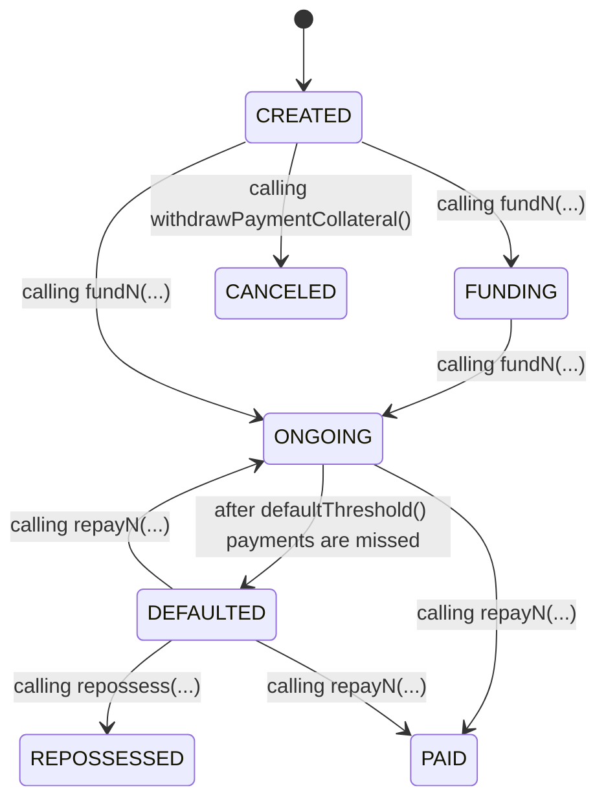

**Inherits:**
[ITinteroLoanEvents](/contracts/interfaces/ITinteroLoan#events), [ITinteroLoanErrors](/contracts/interfaces/ITinteroLoan#errors)

Interface for a loan contract that uses an ERC721 token as collateral.
The loan is funded with an ERC20 token and structured in a series of payments and
tranches.




## Functions
### lendingAsset

*Address of the ERC20 token lent.*


```solidity
function lendingAsset() external view returns (IERC20);
```

### collateralAsset

*Address of the ERC721 token used as collateral.*


```solidity
function collateralAsset() external view returns (ERC721Burnable);
```

### liquidityProvider

*Address of the liquidity provider funding the loan.*


```solidity
function liquidityProvider() external view returns (ITinteroVault);
```

### tranche

*Get the index at which the tranche starts and its recipient.
A tranche is a collection of payments from [paymentIndex ?? 0, nextPaymentIndex)*


```solidity
function tranche(uint256 trancheIndex) external view returns (uint96 paymentIndex, address recipient);
```

### currentTrancheIndex

*Get the index of the current tranche.*


```solidity
function currentTrancheIndex() external view returns (uint256);
```

### totalTranches

*Total tranches in the loan.*


```solidity
function totalTranches() external view returns (uint256);
```

### payment

*Get payment details. A Payment is a struct with a principal and interest terms.*


```solidity
function payment(uint256 index) external view returns (PaymentLib.Payment memory);
```

### collateralId

*Get the collateral tokenId for a payment.*


```solidity
function collateralId(uint256 index) external view returns (uint256);
```

### currentPaymentIndex

*Get the index of the current payment yet to be repaid.*


```solidity
function currentPaymentIndex() external view returns (uint256);
```

### totalPayments

*Get the total number of payments.*


```solidity
function totalPayments() external view returns (uint256);
```

### currentFundingIndex

*Get the index of the current payment yet to be funded.*


```solidity
function currentFundingIndex() external view returns (uint256);
```

### beneficiary

*Address of the beneficiary of the loan.*


```solidity
function beneficiary() external view returns (address);
```

### defaultThreshold

*Amount of missed payments at which the loan is defaulted.*


```solidity
function defaultThreshold() external view returns (uint256);
```

### state

*Get the current state of the loan.*


```solidity
function state() external view returns (LoanState);
```

### pushPayments

*Adds a list of payments to the loan.

Requirements:

- The caller MUST be the liquidity provider.
- The loan MUST be in CREATED state.
- The collateral tokenIds and payments arrays MUST have the same length.
- The payments MUST be ordered by maturity date.
- The payments MUST NOT have matured.
- The collateral tokenIds MUST NOT have been added before.
- The collateralTokenIds MUST exist.
- The owner of each collateral tokenId MUST have approved this contract
to transfer it (if not the contract itself).

Effects:

- The `totalPayments` is incremented by the length of the payments array.
- The `collateralTokenIds` are transferred to this contract.
- The `payment` function will return the added payments at their corresponding
indexes starting at `totalPayments`.
- Emits a `PaymentCreated` event for each payment added.*


```solidity
function pushPayments(uint256[] calldata collateralTokenIds, PaymentLib.Payment[] calldata payments)
    external
    returns (uint256 principalRequested);
```

### pushTranches

*Adds a list of tranches to the loan.

Requirements:

- The caller MUST be the liquidity provider.
- The loan MUST be in CREATED state.
- The tranchePaymentIndexes and trancheRecipients arrays MUST have the same length.
- The tranche indexes MUST be strictly increasing.
- The total number of tranches MUST be less than the total number of payments.

Effects:

- The `totalTranches` is incremented by the length of the tranches array.
- The `tranche` function will return the added tranches at their corresponding
indexes starting at `totalTranches`.
- The tranches are added to the loan.
- Emits a `TrancheCreated` event for each tranche added.*


```solidity
function pushTranches(uint96[] calldata paymentIndexes, address[] calldata recipients) external;
```

### fundN

*Funds `n` payments from the loan.

Requirements:

- The loan MUST be in CREATED or FUNDING state.
- Tranches MUST include all payments.
- The caller MUST have enough funds to fund the payments
- This contract mus have been approved to transfer the principal
amount from the caller.

Effects:

- Moves to FUNDING state
- Moves to ONGOING state if all payments are funded.
- The `currentFundingIndex` is incremented by `n` or the remaining payments.
- The principal of the funded payments is transferred from the liquidity provider to the beneficiary.
- Sets the `fundedAt` field of the funded payments to the current block timestamp.
- Emits a `PaymentsFunded` event with the range of funded payments.*


```solidity
function fundN(uint256 n) external returns (uint256 principalFunded);
```

### withdrawPaymentCollateral

*Withdraws the collateral to the beneficiary.

Requirements:

- The loan MUST be in CREATED or CANCELED state.
- Each payment collateral MUST be owned by this contract.
- The caller MUST be the beneficiary.

Effects:

- Moves to CANCELED state.
- Each payment collateral is transferred to the beneficiary.
- Emits a `PaymentsWithdrawn` with the range of payments withdrawn*


```solidity
function withdrawPaymentCollateral(uint256 start, uint256 end) external;
```

### repayCurrent

*Same as `repayN(0, collateralReceiver)`.*


```solidity
function repayCurrent(address collateralReceiver) external;
```

### repayN

*Repays the current loan and `n` future payments.

Requirements:

- The loan MUST be in ONGOING or DEFAULTED state.
- The sender MUST have enough funds to repay the principal of the specified payments
- The sender MUST have approved this contract to transfer the principal amount
- The collateral MUST be owned by this contract.

Effects:

- Moves to ONGOING if paid until below the default threshold.
- Moves to PAID state if all payments are repaid.
- The `currentPaymentIndex` is incremented by `n` or the remaining payments.
- The principal of the repaid payments is transferred from the sender to the receiver of each payment tranche
- The collateral is transferred to the collateralReceiver if provided, otherwise it is burned.
- Emits a `PaymentsRepaid` event with the range of repaid payments.*


```solidity
function repayN(uint256 n, address collateralReceiver) external;
```

### repossess

*Repossess the collateral from payments.

Requirements:

- The loan MUST be in DEFAULTED or REPOSSESSED state.
- The caller MUST be the liquidity provider.
- The collateral MUST be owned by this contract.
- The receiver MUST implement IERC721Receiver to receive the collateral.

Effects:

- Moves to REPOSSESSED state.
- The collateral is transferred to the receiver.
- Emits a `PaymentsRepossessed` event with the range of repossessed payments.*


```solidity
function repossess(uint256 start, uint256 end, address receiver) external;
```

### upgradeLoan

*Upgrades the loan to a new implementation. Useful for renegotiating terms.*


```solidity
function upgradeLoan(address newImplementation, bytes calldata data) external;
```

## Events
### PaymentCreated
*Emitted when a payment is created.*


```solidity
event PaymentCreated(uint256 indexed index, uint256 indexed tokenId, PaymentLib.Payment payment);
```

### TrancheCreated
*Emitted when a tranche is created.*


```solidity
event TrancheCreated(uint256 indexed index, uint256 indexed paymentIndex, address indexed receiver);
```

### PaymentsFunded
*Emitted when a set of payments is funded. (startIndex, endIndex]*


```solidity
event PaymentsFunded(uint256 indexed startIndex, uint256 indexed endIndex);
```

### PaymentsWithdrawn
*Emitted when the collateral is withdrawn from a set of payments. (startIndex, endIndex]*


```solidity
event PaymentsWithdrawn(uint256 indexed startIndex, uint256 indexed endIndex);
```

### PaymentsRepaid
*Emitted when a set of payment is repaid. (startIndex, endIndex]*


```solidity
event PaymentsRepaid(uint256 indexed startIndex, uint256 indexed endIndex);
```

### PaymentsRepossessed
*Emitted when a set of payments are repossessed by the liquidity provider. (startIndex, endIndex]*


```solidity
event PaymentsRepossessed(address indexed recipient, uint256 indexed startIndex, uint256 indexed endIndex);
```

*Errors for the ERC721 Collateral Loan.*


## Errors
### PaymentFunded
*The loan is already funded so it can't be funded again.*


```solidity
error PaymentFunded(uint256 tokenId);
```

### DuplicatedCollateral
*The payment is already defaulted so it can't be added to the loan.*


```solidity
error DuplicatedCollateral(uint256 tokenId);
```

### UnorderedPayments
*The payment is already defaulted so it can't be added to the loan.*


```solidity
error UnorderedPayments();
```

### OnlyLiquidityProvider
*Only the liquidity provider can perform the operation.*


```solidity
error OnlyLiquidityProvider();
```

### InvalidBeneficiary
*The beneficiary address is not valid.*


```solidity
error InvalidBeneficiary();
```

### OnlyBeneficiary
*Only the beneficiary can perform the operation.*


```solidity
error OnlyBeneficiary();
```

### MismatchedPaymentCollateralIds
*The payments array doesn't match the collateral tokenIds array.*


```solidity
error MismatchedPaymentCollateralIds();
```

### MismatchedTranchePaymentIndexRecipient
*The paymentIndex array doesn't match the tranche recipients array.*


```solidity
error MismatchedTranchePaymentIndexRecipient();
```

### UnincreasingTranchePaymentIndex
*The tranche paymentIndex are not strictly increasing.*


```solidity
error UnincreasingTranchePaymentIndex();
```

### TooManyTranches
*There are more tranches than payments*


```solidity
error TooManyTranches();
```

### UntranchedPayments
*The current tranches do not include all payments.*


```solidity
error UntranchedPayments();
```

### UnexpectedLoanState
*The current state of the loan is not the required for performing an operation.
The `expectedStates` is a bitmap with the bits enabled for each LoanState enum position
counting from right to left.

<Note>
If `expectedState` is `bytes32(0)`, any state is expected.*
</Note>


```solidity
error UnexpectedLoanState(LoanState current, bytes32 expectedStates);
```

*The possible states of a loan.*


```solidity
enum LoanState {
    CREATED,
    CANCELED,
    FUNDING,
    ONGOING,
    DEFAULTED,
    REPOSSESSED,
    PAID
}
```

