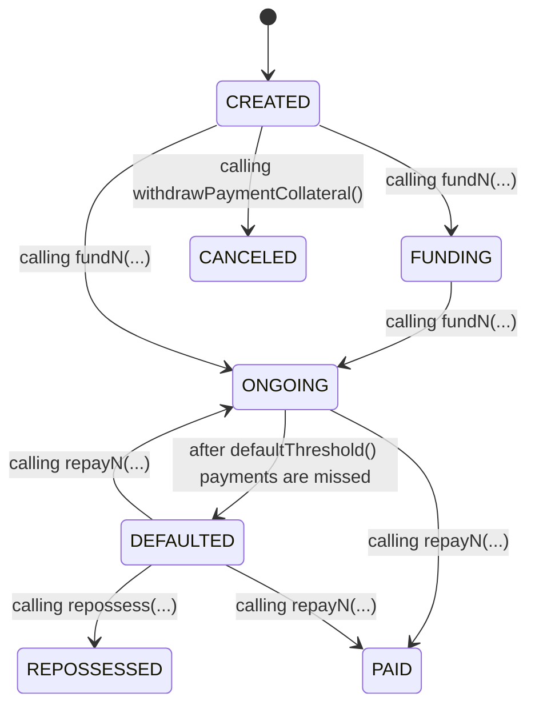

A Loan is a contract deployed by a TinteroVault that requests funding for a series of collateralized payments.

<Frame>

</Frame>

### Payment

A payment is a Solidity struct defined as:

```solidity
struct Payment {
  uint96 principal; // Up to ~79,228,162,514 for 18 decimals
  uint48 fundedAt; // Up to the year 8,925,512
  uint32 maturityPeriod; // Up to ~136 years
  uint32 gracePeriod; // Up to ~136 years
  uint24 interestRate; // Up to ~1677% annualized with 1e4 precision
  uint24 premiumRate; // Up to ~1677% annualized with 1e4 precision
}
```

Once a loan is created, more payments can be pushed to the loan by the vault manager until they specify tranches and funds the loan.

#### Loan Interest calculation

The Loan allocates a list of payments, each has its own regular and premium rates, principal and both maturity and grace period.

The total amount of interest paid back to the vault is calculated as follows:

<Frame>
$$\sum_{p=0}^{p=payments.length} principal_{p} * (i_{p1} * t_{p1} + i_{p2} * t_{p2})$$
</Frame>

Where:

- $$principal_{p}$$: The principal
- $$i_{p1}$$: Interest rate
- $$t_{p1}$$: Time passed after creation date
- $$i_{p2}$$: Premium interest rate
- $$t_{p1}$$: Time passed after maturity date

### Tranches

The process of tranching consist of specifying a list of `paymentIndex` and `receiver` pairs, where `paymentIndex` refers to the index of the last payment that will be included in the tranche and `receiver` is the address that will receive each repayment associated with the tranche.

For example, if a loan has 5 payments and the vault manager wants to create 2 tranches, the first one with payments 0, 1 and 2 and the second one with payments 3, 4 and 5, then the vault manager can push the following tranches

- Tranche 1: `(2, receiver1)`
- Tranche 2: `(5, receiver2)`

<Note>
Tranches are sold to different investors, but the first tranche must typically belong to the vault it was created from. This way the vault accrues the least risky payments while asset originators can sell the riskier tranches to investors.
</Note>

## Lifecycle

### Created

A loan is created by a TinteroVault when a borrower requests a loan. The loan is initialized with a beneficiary address, a default threshold and a collateral collection (i.e. the ERC-721 tokens that will be used as collateral for the loan).

Vault manager can push payments to the loan accompanied by a `tokenId` and create tranches for the loan.

<Note>
Pushing a payment to a loan will only succeed if the `tokenId`of the corresponding collateral collection is owned by the loan contract already or if the loan contract is the approved operator of the `tokenId`.
</Note>

<Tip>
The Loan contract address is deterministic. In theory, the loan can receive the collateral assets during creation if the collateral owner approves the counterfactual address before the loan is created.
</Tip>

### Canceled

If the loan is not funded, the beneficiary can always call `withdrawPaymentCollateral` to get their collateral. Once this is done, the loan transitions to the `CANCELED` state and the only remaining action is to transfer the withdraw the remaining collateral (if any) back to the beneficiary.

### Funding

Once the loan starts receiving funding, it transitions to the `FUNDING` state. The loan can be funded by the vault manager by calling the `fundN` function with the amount of payments to fund from remaining unfunded payments in the loan.

### Ongoing

When the loan is fully funded, it transitions to the `ONGOING` state. The loan is now ready to start receiving repayments from the beneficiary.

### Defaulted

If the beneficiary misses `defaultThreshold` payments in a row, the loan automatically transitions to the `DEFAULTED` state. The vault manager can repossess the collateral by calling the `repossess` function and providing a receiver. This can be an independent entity that will exercise the collateral obligation in the real world.

### Repossessed

Once the collateral is repossessed, the loan transitions to the `REPOSSESSED` state. The contract is finished and the only remaining action is to reposess the remaining collateral (if any).

### Paid

If the beneficiary repays all the payments in the loan, the loan transitions to the `PAID` state. The contract is finished and the only remaining action is to transfer the remaining collateral (if any) back to the beneficiary.

